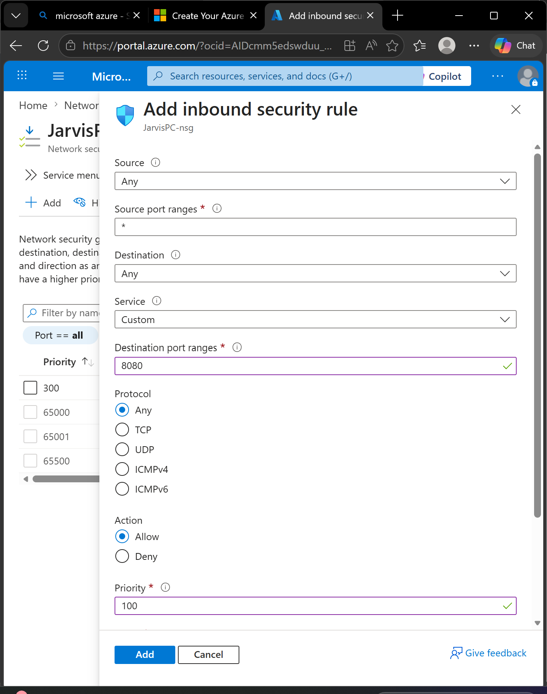
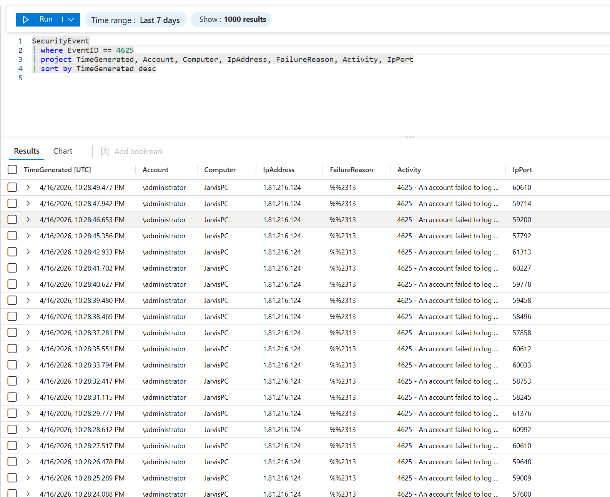
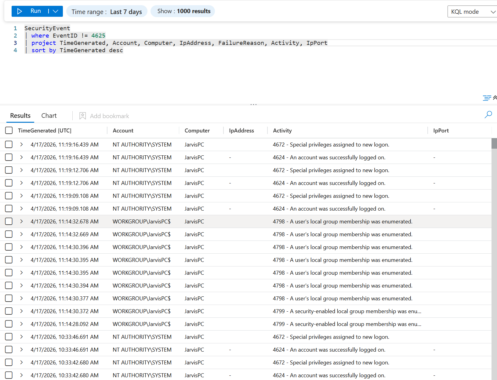
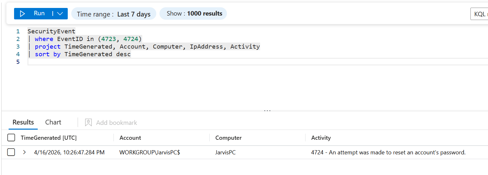
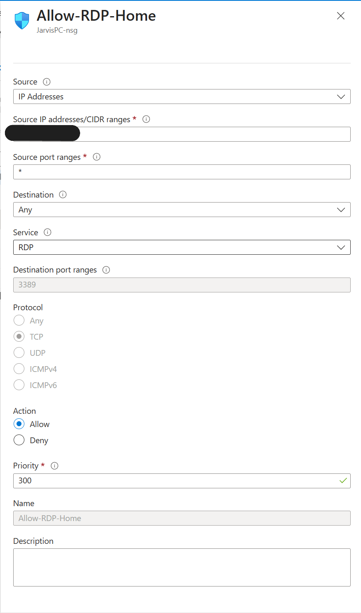

# Incident Report – Azure VM Compromise

## Summary
This lab was designed to simulate a real‑world security incident in a controlled Azure environment. I deployed a Windows Server VM, intentionally exposed RDP to the internet, and monitored how quickly it would be targeted. After removing the original RDP rule and replacing it with an “Allow Any” inbound rule, the VM began receiving automated brute‑force attempts almost immediately. One of those attempts eventually succeeded, and the attacker logged in and changed the local administrator password. I used Azure’s built‑in recovery tools to regain access, reviewed the logs to understand what happened, and then hardened the VM.

## Timeline
- Deployed a Windows Server VM with a public IP
- Removed the original RDP rule on purpose to fully expose the VM
- Added a new inbound NSG rule allowing RDP from any source
  ### Original Inbound Rule (Intentional Exposure)
  
  - This was the initial inbound rule I created to intentionally expose the VM. Allowing traffic from any source with no restrictions made the system vulnerable to automated scanning and brute‑force attacks.

  
- Brute‑force attempts began within minutes
- Created a Log Analytics Workspace, enabled Microsoft Sentinel, and installed the Azure Monitor Agent
- Started seeing repeated failed login attempts (Event ID 4625) from various external IPs
  ### Failed Login Attempts (Event ID 4625)
  
  

- Eventually observed a successful login (Event ID 4624) from an unknown IP
  ### Successful Login & Attacker Activity
  
  

- Shortly after the successful login, the local administrator password was changed
  ### Password Reset Event (Event ID 4724)
  

  
- Lost access to the VM
- Used Azure’s Reset Password feature to regain control
- Updated the NSG to only allow RDP from my home IP
  ### Hardened NSG Rule
  
  

- Re‑enabled Windows Firewall inside the VM and restored default rules
- Reviewed logs to confirm attacker activity and validate system integrity

## Impact
No sensitive data was stored on the VM, and the environment was isolated, so the impact was limited to the VM itself.
- Unauthorized access to the VM
- Local admin password changed
- Potential exposure of system configuration
- Required manual recovery and security hardening

## Root Cause
The VM was intentionally exposed to the internet for testing. Removing the original RDP rule and replacing it with an “Allow Any” inbound rule left the VM completely open to automated scanning and brute‑force attacks. With no IP restrictions in place, the attacker was able to brute‑force the local administrator account and gain access.

## Investigation Details  
After regaining access, I used Microsoft Sentinel and Log Analytics to review the attack activity. Key findings included:

- Event ID 4625 logs showing repeated failed login attempts from multiple external IPs
- Event ID 4624 indicating a successful login from an IP not associated with my network
- A password change event shortly after the successful login
- No signs of lateral movement (expected, since this was an isolated lab VM)
- Firewall rules inside the VM had been modified during the compromise
- I used KQL queries to filter and analyze the logs, including:

```kql
SecurityEvent
| where EventID == 4625
| project TimeGenerated, Account, Computer, IpAddress, FailureReason, Activity, IpPort
| sort by TimeGenerated desc

SecurityEvent
| where EventID != 4625
| project TimeGenerated, Account, Computer, IpAddress, FailureReason, Activity, IpPort
| sort by TimeGenerated desc
```

## Remediation
- Removed the “Allow Any” inbound rule
- Restricted RDP to a trusted IP
- Re‑enabled Windows Firewall
- Verified system integrity
- Enabled Defender for Cloud recommendations

## Lessons Learned
- Exposing RDP to the internet results in immediate brute‑force attempts
- Azure’s Reset Password tool is extremely useful for recovering compromised VMs
- NSG rules and firewall settings must be tightly controlled
- Logging and monitoring make it much easier to understand attacker behavior
- Even a simple lab environment can quickly turn into a realistic incident
